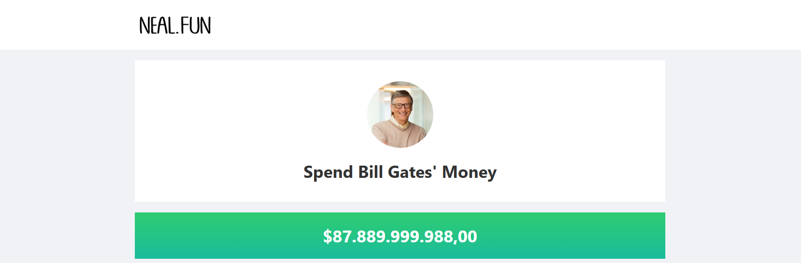
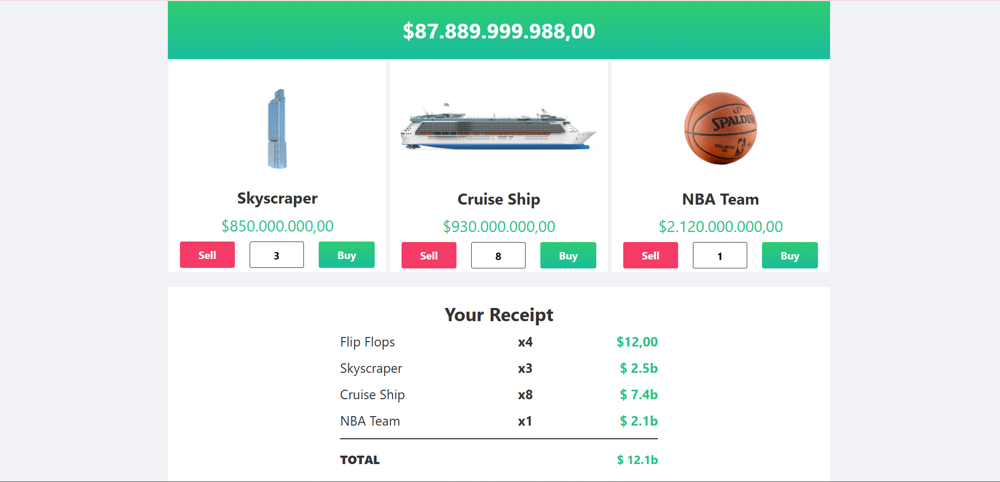

# Bill Gates Alışveriş Simülasyonu

Bu proje, Bill Gates'in 100,000,000,000$ ile hayali ürünler satın alabileceği bir alışveriş simülasyonudur. Kullanıcı, listelenen ürünlerden satın alıp satabilir ve bakiyesinin değişimini gözlemleyebilir.

## 📸 Proje Görselleri

## Canlı Proje Linki

[Proje Linki](https://billgates.erkankaradag.com/)

## Özellikler

Hayali ürün listesi: Kullanıcıya çeşitli fiyatlarla ürünler sunulur.

Başlangıç Bakiyesi: Kullanıcıya 100,000,000,000$ bakiye verilir.

Satın Alma ve Satma:

Satın alınan ürünlerin fiyatı kadar bakiyeden düşülür.

Satılan ürünlerin fiyatı kadar bakiye artar.

## Düğme ve Buton Durumları:

Hiç satın alınmamış bir ürün için "Sell" butonu devre dışı olmalıdır.

Kullanıcının bakiyesi, ürün fiyatından az ise "Buy" butonu devre dışı olmalıdır.

## Alınan Ürünlerin Listelenmesi:

Satın alınan ürünler, adetleri ve toplam maliyetleri ile ekranın altında görüntülenir.

## Kullanım

Satın almak istediğiniz ürünün yanındaki Buy butonuna basarak alım yapabilirsiniz.

Sell butonuna basarak aldığınız ürünleri satabilirsiniz.

Bakiyenizi kontrol ederek fiyatınız yettiği kadar alım yapabilirsiniz.

En altta, satın aldığınız ürünleri ve toplam maliyetlerini görebilirsiniz.

## Teknolojiler

React kullanılarak geliştirildi.

State yönetimi için useState kullanıldı.

Butonların aktif/pasif durumu state değişkenlerine bağlı.
