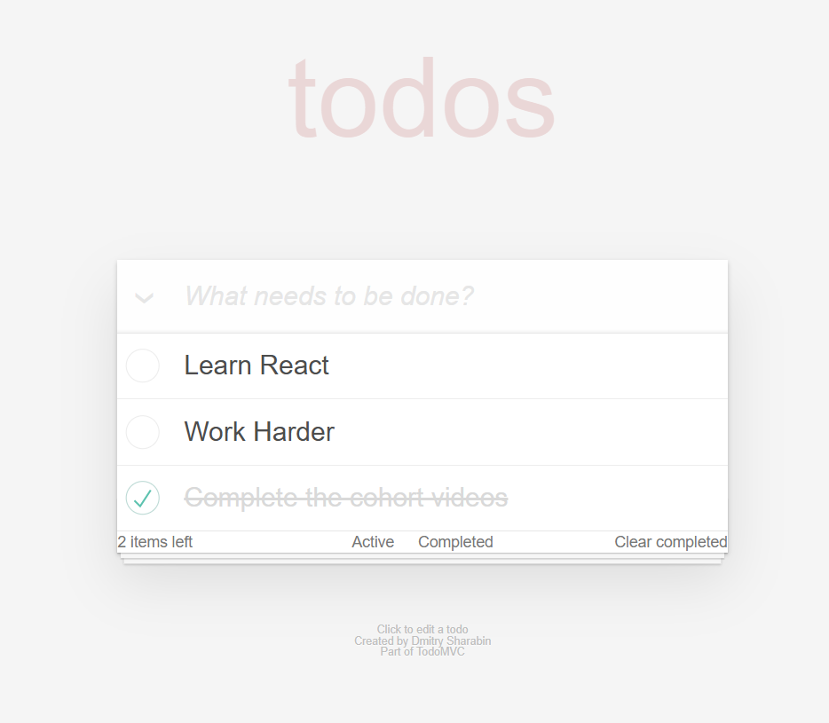
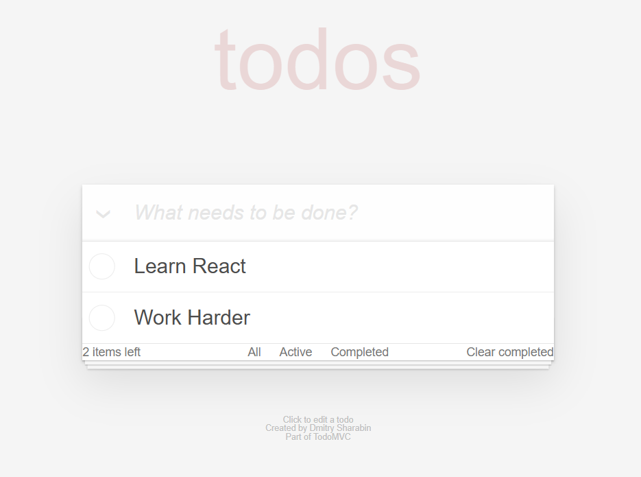
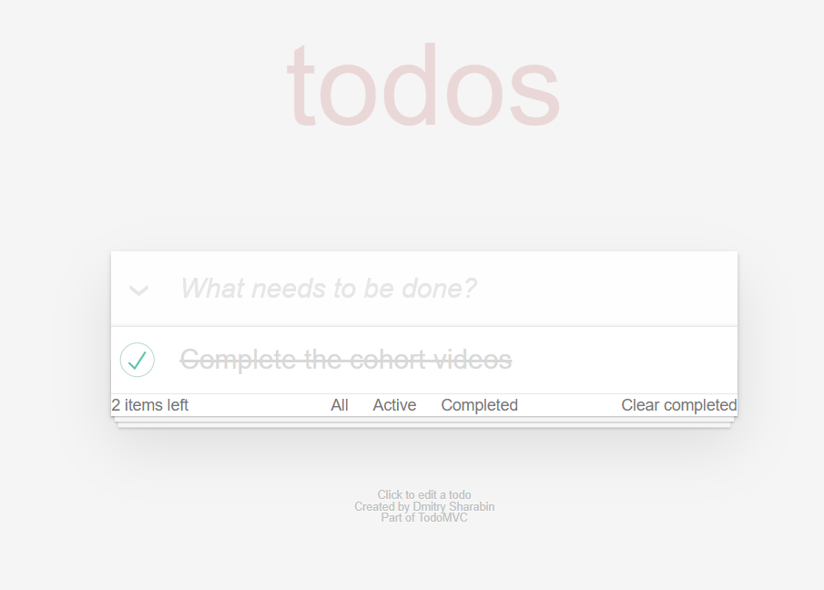

# To Do App With React 
Bu proje, React ve Vite kullanarak yapılmış basit bir To-do-app uygulamasıdır. Kullanıcılar görevlerini ekleyebilir, tamamlayabilir, silebilir ve filtreleyebilirler.

## Özellikler

Görev Ekleme: Kullanıcılar yeni görevler ekleyebilir.

Görev Tamamlama: Kullanıcılar görevleri tamamlandıklarında işaretleyebilir.

Görev Silme: Kullanıcılar tamamlanmış görevleri silebilir.

Filtreleme: Görevler, tamamlananlar, aktif olanlar veya tüm görevler olarak filtrelenebilir.

Görev Sayısı: Toplamda kaç tane aktif görev olduğu gösterilir.

Clear Completed: Tamamlanmış görevleri topluca silme özelliği.

## Teknolojiler
React: Kullanıcı arayüzü oluşturmak için.

Vite: Hızlı geliştirme için build aracıdır.

CSS: Stil ve görünüm için.

## Proje Görselleri

