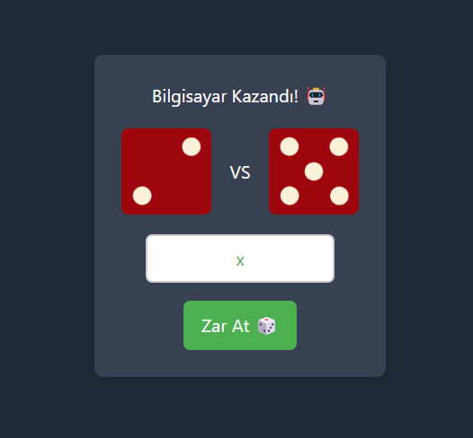

# Dice Game

This is a simple and interactive Dice Game built with React. In this game, the user (Player1) rolls a dice and competes against the computer (AI) in a dice roll battle. The outcome of each round is displayed, and the game continues until the player chooses to roll the dice again. The dice images and animations are included to provide a smooth, engaging user experience.

## Features

- The user can input their name.
- Dice are rolled with a random outcome between 1 and 6.
- The result (Winner or Draw) is displayed after each roll.
- Dice animations for smooth visual effects.

## Screenshot

